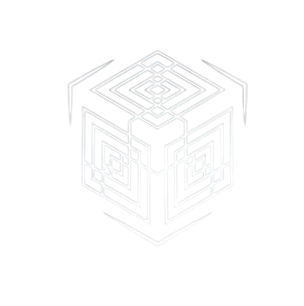

<table>
  <tr>
    <td></td>
    <td><h1 style="margin-left: 12px;">TESSERACT – AI Chatbot with PDF Upload & Gemini Integration</h1></td>
  </tr>
</table>


TESSERACT is a smart AI chatbot built with **Next.js**, **ShadCN**, and **Google's Gemini API**. It allows users to have natural conversations, upload PDFs, and get contextual responses based on document content.
-- Optional: Replace or remove -->

---

## 🚀 Features

- 💬 Natural, markdown-formatted conversations  
- 📄 Upload **PDFs** and ask context-based questions  
- 🤖 Powered by **Google Gemini Flash**  
- 🎨 Elegant dark UI using **ShadCN**, **TailwindCSS**, and **Framer Motion**  
- 🧪 Developed & debugged with **Postman API**

---

## 🛠️ Tech Stack

| Layer         | Technology                                |
|---------------|--------------------------------------------|
| Framework     | Next.js (App Router), React, TypeScript    |
| Styling       | TailwindCSS, ShadCN UI, Framer Motion      |
| AI API        | Google Gemini (Flash model)                |
| File Parsing  | `pdf.js` (via CDN)                         |
| Debugging     | Postman for API testing                    |

---

## 📦 Installation

```bash
git clone https://github.com/Kalam2002/Tesseract-AI.git
cd Tesseract-AI

npm install
npm run dev
